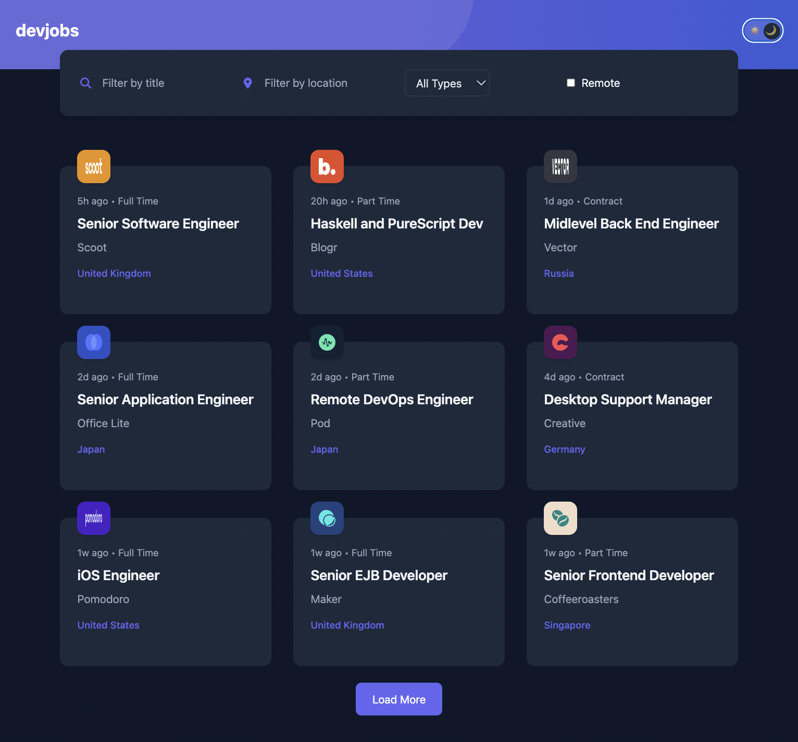
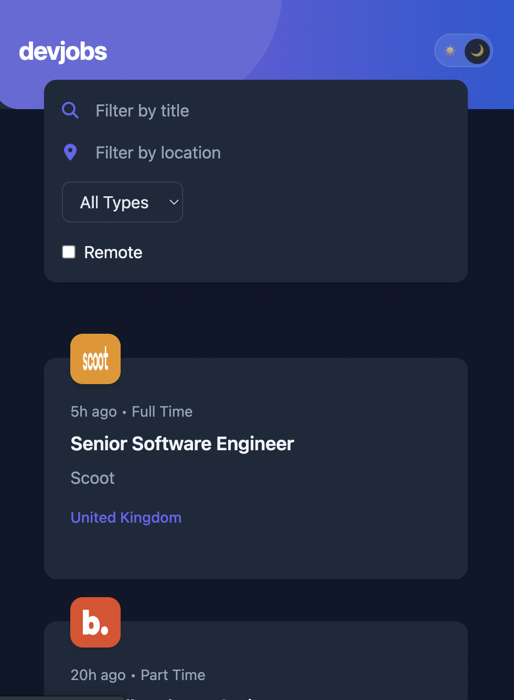
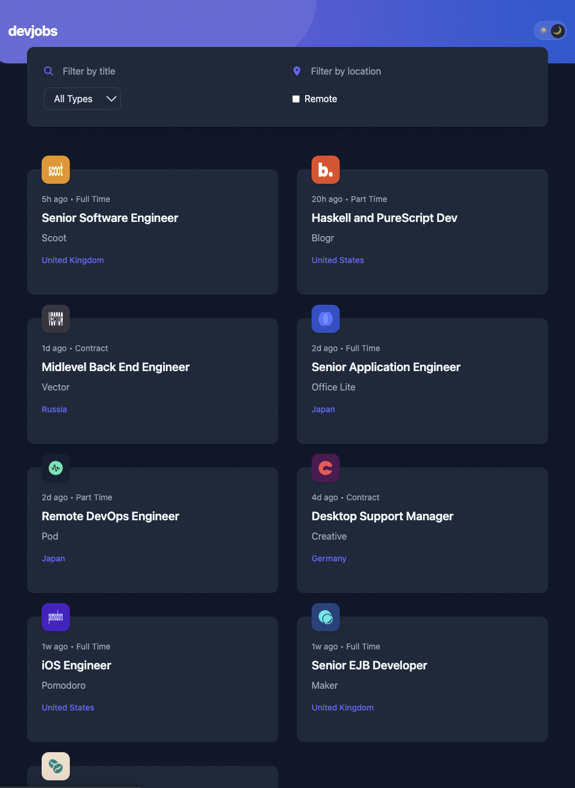

# Job Board App 💼

A modern job board application built with React, featuring dynamic filtering, responsive design, and a clean user interface.

## 🚀 Live Demo

🔗 https://react-job-board-theta.vercel.app/

## 📂 GitHub Repository

🔗 https://github.com/Zarah679/react-job-board

---

## ✨ Features

* 🔍 Search jobs by title or company
* 📍 Filter by location
* 🕒 Filter by job type (Full-time, Part-time, etc.)
* 🌙 Light & Dark mode toggle
* 📱 Fully responsive design
* 📦 Load more jobs functionality
* 📦 Loading state
* 📦 Empty state
* ⚡ Fast and optimized with Vite

---

## 🛠️ Built With

* React
* JavaScript (ES6+)
* Tailwind CSS
* Vite

---

## 📸 Screenshots

### Desktop View



### Mobile View



### Tablet View



---

## 🧠 What I Learned

* Managing state and filters in React
* Structuring a scalable component-based architecture
* Working with mock data and dynamic rendering
* Improving UI/UX with responsive layouts and theming

---

## 📌 Future Improvements

* Add backend integration (real job API)
* Save/bookmark jobs
* Authentication (user accounts)
* Pagination instead of load more

---

## ⚙️ Installation

```bash
git clone https://github.com/Zarah679/react-job-board.git
cd job-board
npm install
npm run dev
```

---

## 🙌 Acknowledgements

Design inspired by Frontend Mentor challenge.
